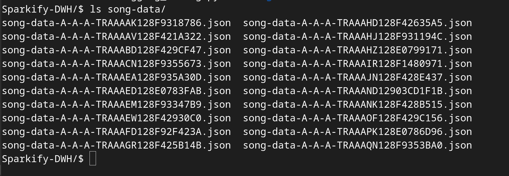
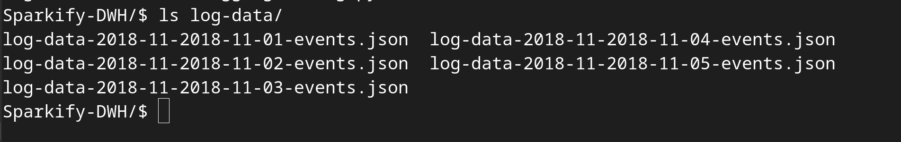
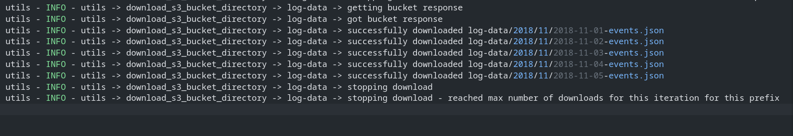

# Sparkify-DWH
A music streaming startup, Sparkify, has grown their user base and song database and want to move their processes and data onto the cloud. Their data resides in S3, in a directory of JSON logs on user activity on the app, as well as a directory with JSON metadata on the songs in their app.

<br/>

In this project I build an ETL pipeline that extracts their data from S3, stages them in a staging db, and transforms data into a set of dimensional and facts tables in a dara warehouse for the analytics team to continue finding insights in what songs their users are listening to. 

<br/>
<br/>

# Project structure
- `explore_source.ipynb` 
	- a jupyter notebook containing initial general exploration of the data source, like the data size, the number of files and their structure.
	- determining from which files the tables will take data from

- `etl.py`
	- general sequence of the project etl

- `utils.py`
	- a set of useful handy functions used in the etl process

- `logging_config.py`
	- general configuration for the logger used in the etl process

<br/>
<br/>

# ETL Process
We start by fetching the source data from the aws s3 bucket, we don't download all files at once, because there are many files (1000+) and it will take time. So as a result the etl will need to be exucuted more than once, and the script logic won't download already downloaded files again.

<br/>

This is useful too to test the pipeline continuity (inserting only new data when running the etl again and handling the scd type 2 if it occurs).

<br/>

Here shown only downloading the number of times specified
```python
def etl():
	# download s3 data
	download_s3_bucket_directory(bucket_name = 'udacity-dend', prefix_name = 'song-data', max_download_number = 20)
	download_s3_bucket_directory(bucket_name = 'udacity-dend', prefix_name = 'log-data', max_download_number = 5)
```






<br/>

A sample of the log



